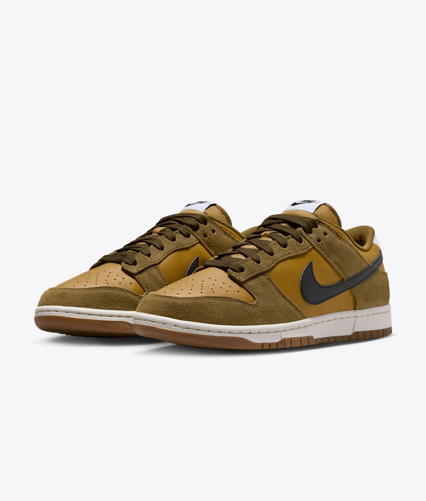

# Product Authentication using ORB (OpenCV)

## Overview
Feature-based system to verify whether two product images belong to the same item using ORB keypoint matching.

## Approach
- ORB feature extraction  
- BFMatcher for keypoint matching  
- Distance filtering for good matches  
- Similarity score + threshold-based classification  

## Results
- High similarity for same product (different angles)  
- Low similarity for different products  

## Sample

## Tech Stack
Python, OpenCV

## Limitations
Sensitive to viewpoint and lighting changes

## Conclusion
Feature-based matching using ORB provides a fast and interpretable approach for basic product verification tasks.
